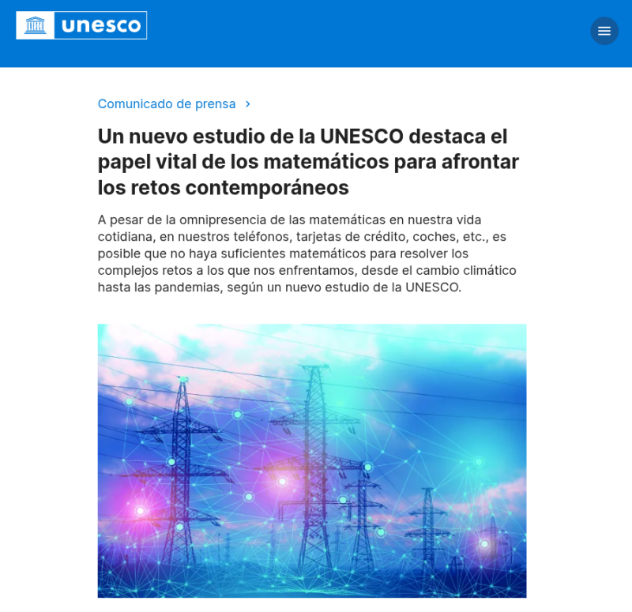
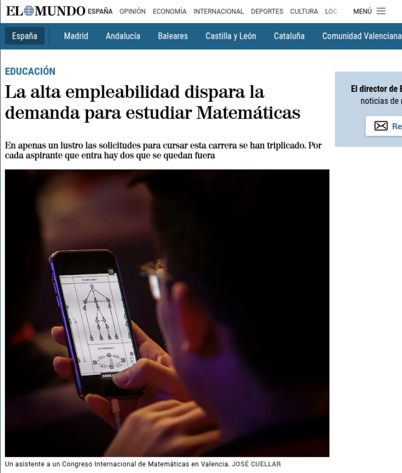
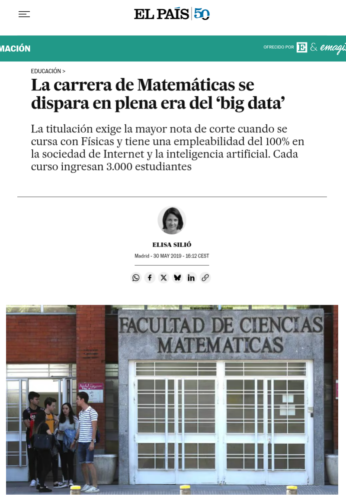
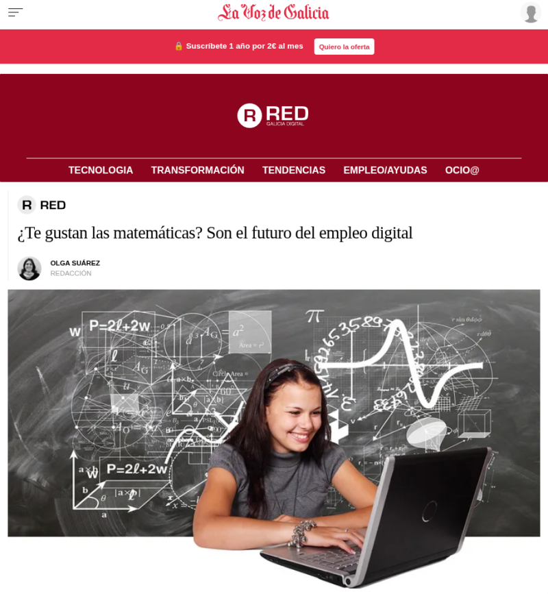
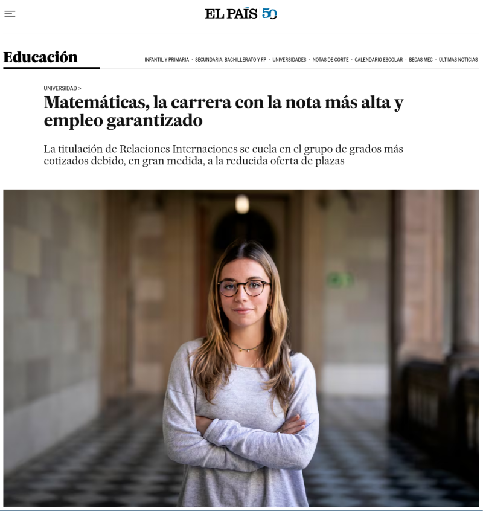
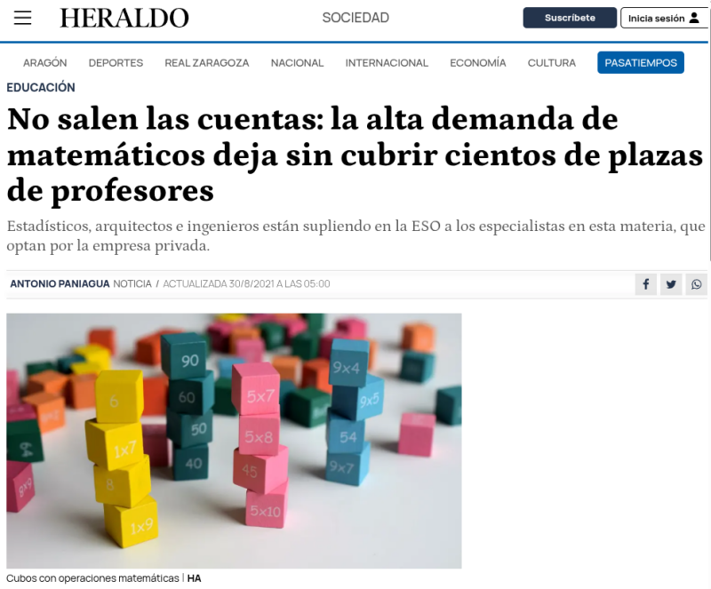
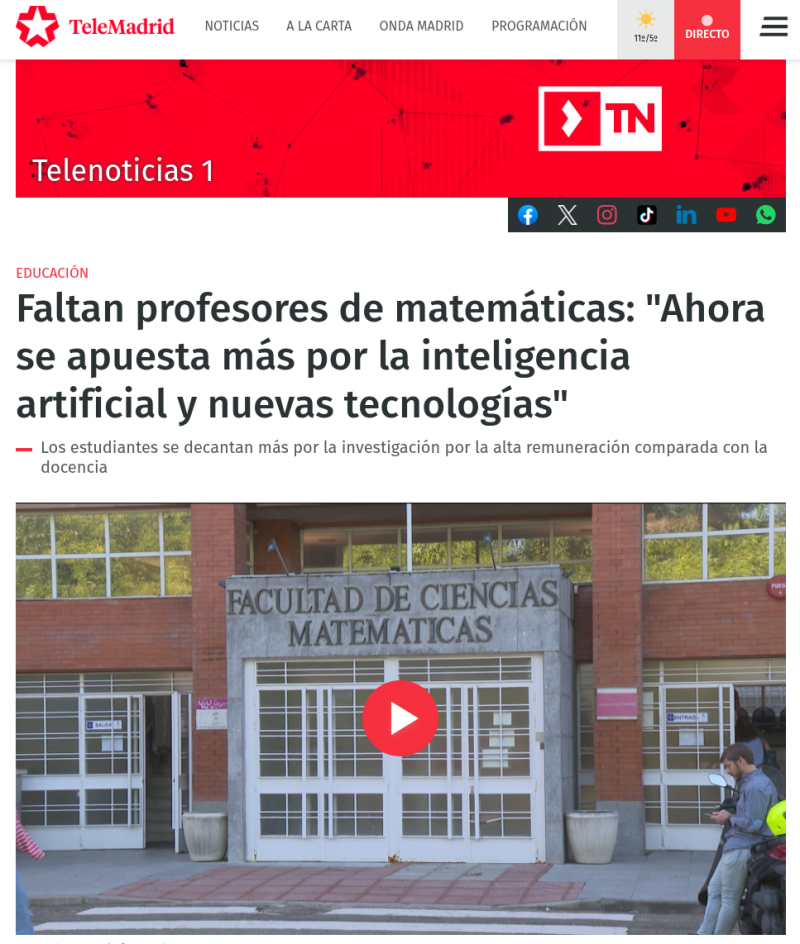
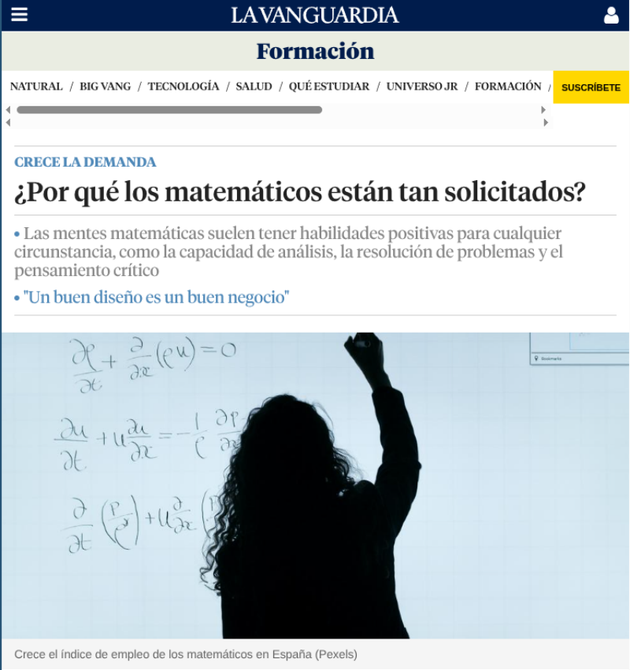
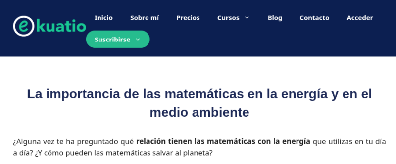

## [Un nuevo estudio de la UNESCO destaca el papel vital de los matemáticos para afrontar los retos contemporáneos](https://www.unesco.org/es/articles/un-nuevo-estudio-de-la-unesco-destaca-el-papel-vital-de-los-matematicos-para-afrontar-los-retos)

  

---

## [La alta empleabilidad dispara la demanda para estudiar Matemáticas](https://www.elmundo.es/espana/2022/04/14/6256f6c9fdddff21668b45aa.html)

 

---

## [La carrera de Matemáticas se dispara en plena era del Big Data](https://elpais.com/sociedad/2019/05/28/actualidad/1559060134_280031.html)

---

## [¿Te gustan las Matemáticas? Son el futuro del empleo digital](https://www.lavozdegalicia.es/noticia/reto-digital/empleo/2023/04/13/gustan-matematicas-futuro-empleo-digital/00031681379378675789364.htm)

## [Matemáticas, la carrera con la nota más alta y empleo garantizado](https://elpais.com/educacion/2023-05-19/matematicas-la-carrera-con-la-nota-mas-alta-y-empleo-garantizado.html)

---

## [La alta demanda de matemáticos deja sin cubrir cientos de plazas de profesores](https://www.heraldo.es/noticias/sociedad/2021/08/30/educacion-alta-demanda-matematicos-deja-sin-cubrir-cientos-plazas-profesores-1515968.html)

---

## [Faltan profesores de matemáticas: "Ahora se apuesta más por la inteligencia artificial y nuevas tecnologías"](https://www.telemadrid.es/programas/telenoticias-1/Faltan-profesores-de-matematicas-Ahora-se-apuesta-mas-por-la-inteligencia-artificial-y-nuevas-tecnologias-2-2489171092--20220920045710.html)

---

## [¿Porqué los matemáticos están tan solicitados?](https://www.lavanguardia.com/vida/formacion/20210315/6375507/matematicas-sector-solicitado-empresas-big-data-resolucion-problemas.html)

---

## [Formas en que las matemáticas pueden salvar el mundo](https://ekuatio.com/la-importancia-de-las-matematicas-en-la-energia-y-en-el-medio-ambiente/)

## [Informe de CCOO sobre la empleabilidad según formación](https://datawrapper.dwcdn.net/7bo5b/1/)

    
    <embed type="text/html" src="https://datawrapper.dwcdn.net/HyDmY/3/" width="800" height="600">
    

    
    <embed type="text/html" src="https://datawrapper.dwcdn.net/7bo5b/1/" width="800" height="600">
    